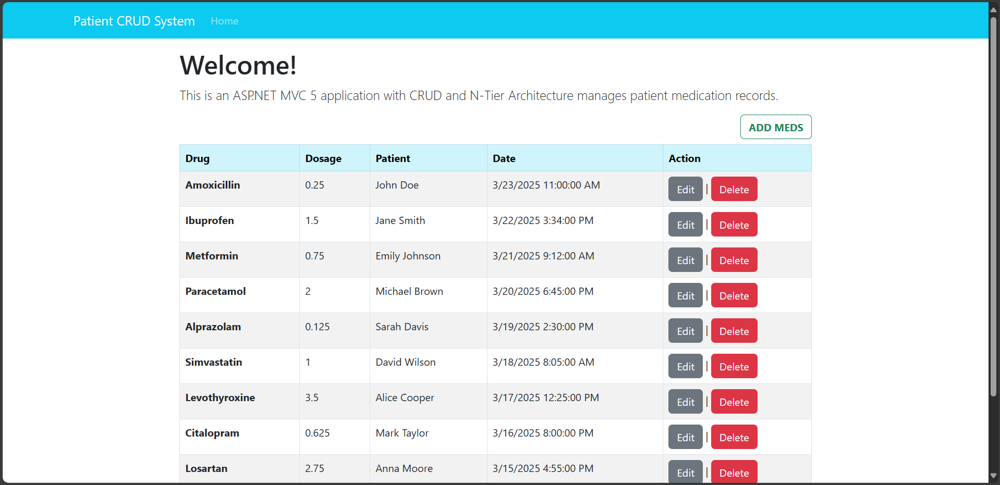
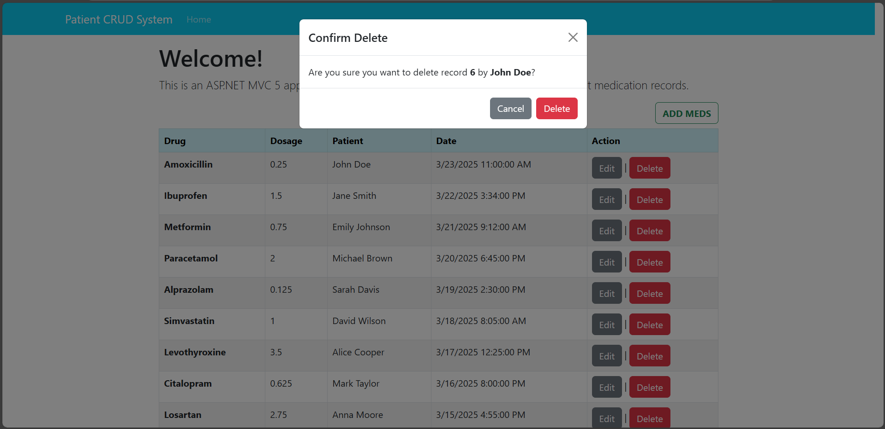
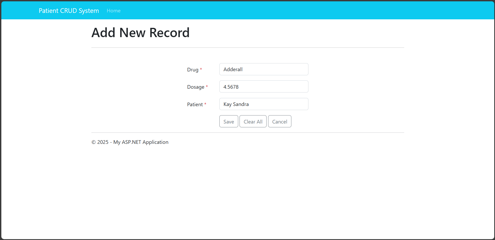

# Patient CRUD System

## Overview
The **Patient CRUD System** is a simple web-based application that allows users to manage patient records, including adding, updating, viewing, and deleting patient medication.

## Features
- ➕ **Add Medicaion for Patient**
- 📄 **View Patient List**
- ✏️ **Update Patient Medication**
- ❌ **Delete Patient Records**

## Screenshots





## Installation
1. Clone the repository:
   ```sh
   git clone https://github.com/your-username/PatientCRUDSystem.git
